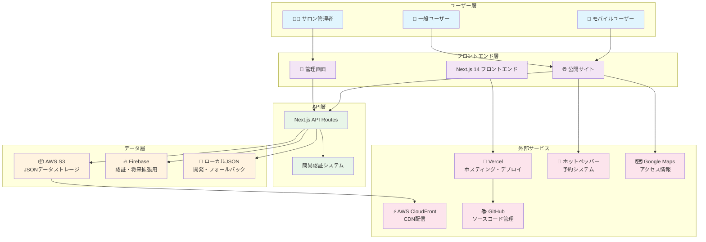
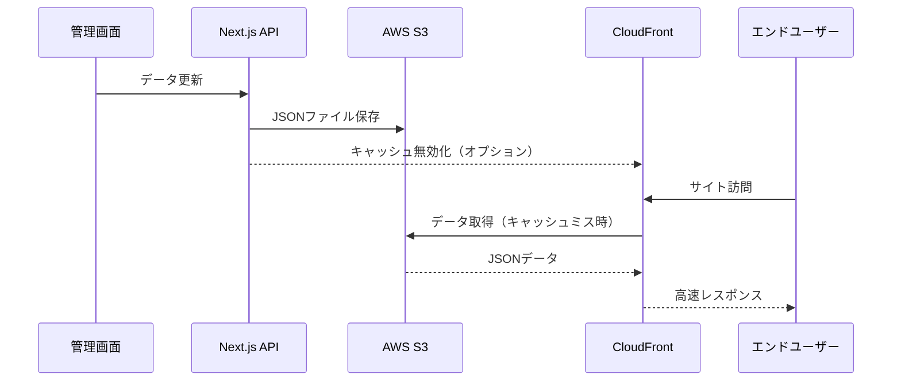
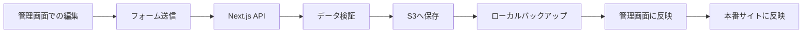
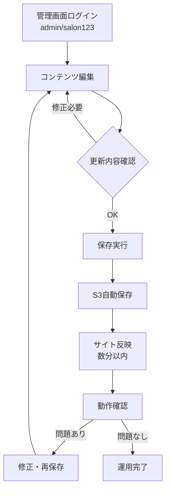
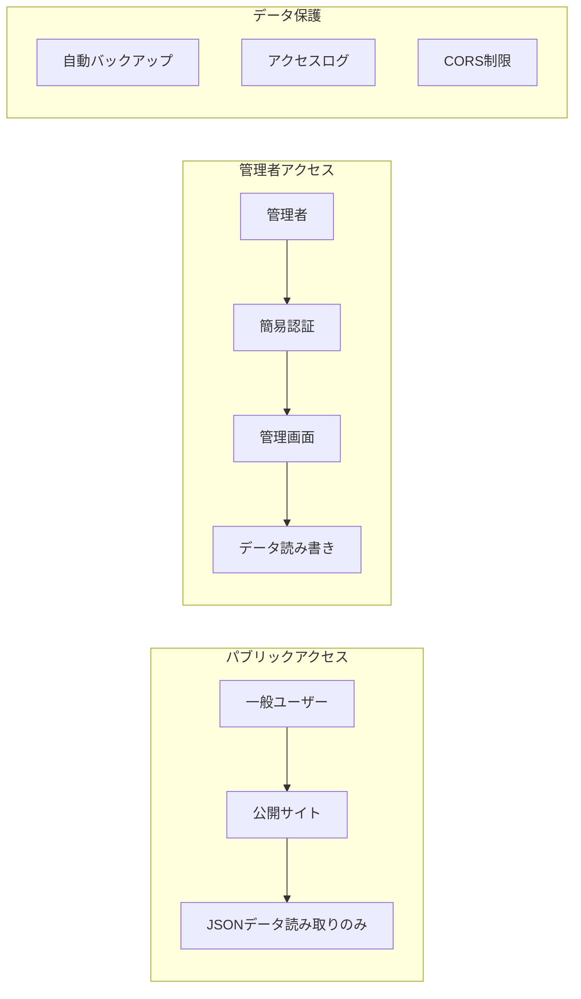
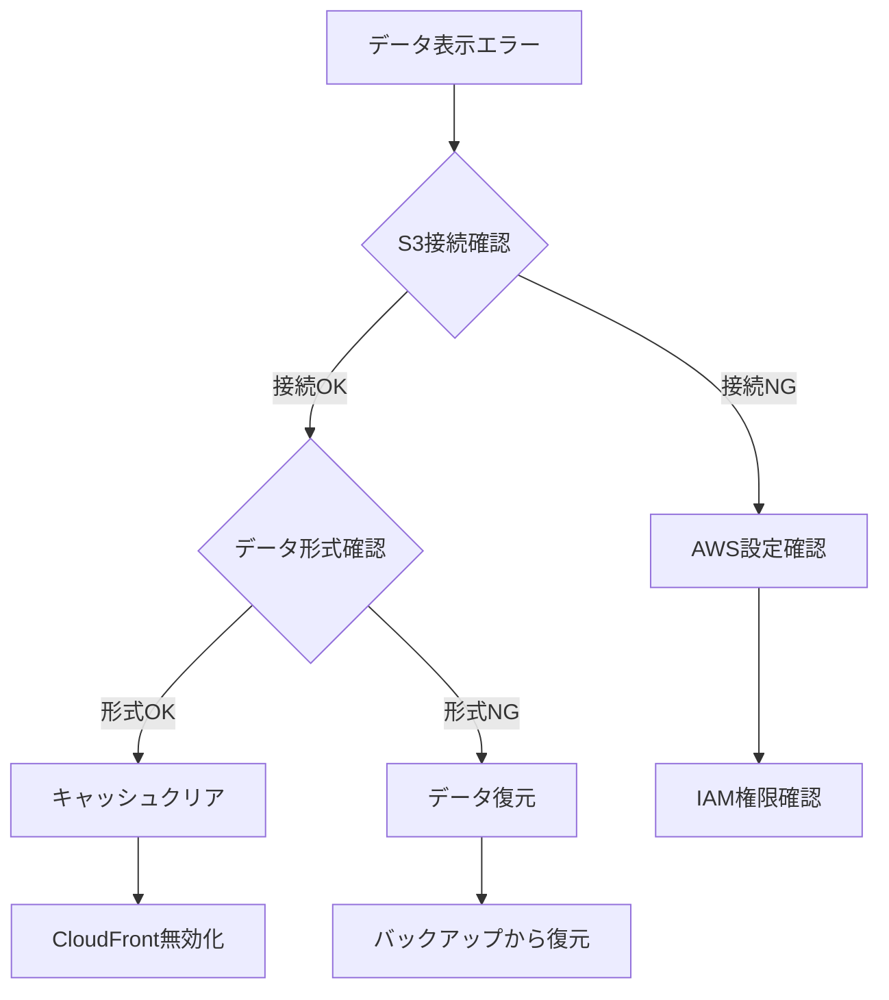

# 長瀬サロン Webサイト プロジェクト総合設計書

## 📋 目次
1. [プロジェクト概要](#プロジェクト概要)
2. [システム構成図](#システム構成図)
3. [技術スタック](#技術スタック)
4. [外部サービス連携](#外部サービス連携)
5. [管理サイト仕様](#管理サイト仕様)
6. [運用方法](#運用方法)
7. [セキュリティとデータ保護](#セキュリティとデータ保護)
8. [禁止事項・制約事項](#禁止事項制約事項)
9. [開発・デプロイフロー](#開発デプロイフロー)
10. [監視・保守・トラブルシューティング](#監視保守トラブルシューティング)

---

## 🎯 プロジェクト概要

### プロジェクト基本情報
- **プロジェクト名**: 長瀬サロン公式Webサイト
- **参考デザイン**: [Ocean Tokyo](https://www.oceantokyo.com/)
- **開発期間**: 長期プロジェクト（継続的改善）
- **主要目的**: 美容院の魅力的な情報発信とオンライン予約受付

### プロジェクト目標
- 📱 **レスポンシブ**: モバイルファーストのユーザビリティ
- ⚡ **パフォーマンス**: 3秒以内のページ読み込み
- 🎨 **デザイン**: Ocean Tokyoスタイルのモダンで清潔感のあるUI
- 💰 **低コスト**: 月間200円以下の運用コスト
- 🔧 **管理性**: 非技術者でも簡単にコンテンツ更新可能

---

## 🏗️ システム構成図



---

## 💻 技術スタック

### フロントエンド
| 技術 | バージョン | 役割 |
|------|------------|------|
| **Next.js** | 14.2.31 | React フレームワーク・SSR・API Routes |
| **React** | 18 | UI コンポーネント |
| **TypeScript** | 5 | 型安全性 |
| **Tailwind CSS** | 3.4.1 | スタイリング・レスポンシブ |

### バックエンド・インフラ
| 技術 | 役割 |
|------|------|
| **Vercel** | ホスティング・自動デプロイ |
| **AWS S3** | JSONデータストレージ |
| **AWS CloudFront** | CDN・画像配信最適化 |
| **Firebase** | 認証・将来拡張用 |

### 開発・運用ツール
| ツール | 役割 |
|--------|------|
| **ESLint** | コード品質チェック |
| **Prettier** | コードフォーマット |
| **GitHub** | バージョン管理・CI/CD |
| **npm scripts** | S3データ管理・バックアップ |

---

## 🔗 外部サービス連携

### 1. AWS S3 + CloudFront


**設定内容:**
- **バケット名**: `nagase-salon-data`
- **リージョン**: `ap-northeast-1` (東京)
- **アクセス権限**: パブリック読み取り（JSONのみ）
- **CORS設定**: 適切なオリジン制限
- **キャッシュ**: JSONファイル60秒、画像1日

### 2. Vercel デプロイメント
- **自動デプロイ**: main/developブランチ
- **環境変数**: AWS認証情報・Firebase設定
- **カスタムドメイン**: 設定可能
- **API制限**: 10秒タイムアウト

### 3. ホットペッパービューティー連携
- **予約フロー**: サイト → ホットペッパー外部リンク
- **フォールバック**: 詳細予約フォーム（非表示設定）

### 4. Google Maps API
- **アクセスページ**: 埋め込み地図表示
- **将来拡張**: 近隣店舗検索・ルート案内

---

## 🛠️ 管理サイト仕様

### ログイン認証
```typescript
// 簡易認証（デモ環境）
Username: admin
Password: salon123
```

### 管理可能なコンテンツ

#### 1. スタイリスト管理 (`/admin/stylists`)
| 項目 | 設定内容 |
|------|----------|
| **基本情報** | 名前、役職、経験年数、プロフィール |
| **スキル** | カット、カラー、パーマ等のレベル設定 |
| **SNS** | Instagram、Twitter、TikTokリンク |
| **画像** | プロフィール画像・ポートフォリオ |

#### 2. メニュー・料金管理 (`/admin/menu`)
| 項目 | 設定内容 |
|------|----------|
| **カテゴリ** | カット、カラー、パーマ、その他 |
| **メニュー詳細** | 名称、説明、所要時間、価格 |
| **特別メニュー** | 期間限定・おすすめマーク |

#### 3. ニュース管理 (`/admin/news`)
| 項目 | 設定内容 |
|------|----------|
| **記事タイプ** | お知らせ、キャンペーン、イベント |
| **公開設定** | 公開/非公開、公開期間 |
| **画像** | アイキャッチ画像 |

#### 4. スタイル写真集 (`/admin/styles`)
| 項目 | 設定内容 |
|------|----------|
| **カテゴリ** | ショート、ミディアム、ロング、カラー |
| **タグ** | 検索用フィルタ |
| **スタイリスト** | 担当スタイリスト紐付け |

#### 5. サロン基本情報 (`/admin/salon`)
| 項目 | 設定内容 |
|------|----------|
| **営業情報** | 営業時間、定休日、電話番号 |
| **住所** | 〒、住所、最寄り駅 |
| **SNS** | 公式アカウントリンク |

#### 6. サイト設定 (`/admin/settings`)
| 項目 | 設定内容 |
|------|----------|
| **ヒーロー画像** | トップページスライドショー |
| **ブランド設定** | ロゴ、カラーテーマ |
| **SEO設定** | メタタグ、サイトマップ |

### データ保存の流れ


---

## 🔄 運用方法

### 日常運用フロー

#### 1. コンテンツ更新手順


#### 2. 定期メンテナンス（推奨）
| 頻度 | 作業内容 | コマンド |
|------|----------|----------|
| **毎週** | データバックアップ | `npm run s3:backup` |
| **毎月** | データ整合性チェック | `npm run s3:validate` |
| **大更新前** | フルバックアップ | `npm run s3:backup -- --name=before-update` |

#### 3. パフォーマンス監視
- サイト速度: [PageSpeed Insights](https://pagespeed.web.dev/)
- 可用性: Vercelダッシュボード
- コスト: AWSコンソール請求画面

### 料金目安（月額）
| サービス | 使用量 | 料金 |
|----------|--------|------|
| **Vercel** | Hobbyプラン | 無料 |
| **S3ストレージ** | 100MB | 約3円 |
| **S3リクエスト** | 10,000回 | 約5円 |
| **CloudFront** | 10GB転送 | 約120円 |
| **Firebase** | 認証のみ | 無料 |
| **合計** | | **約130円/月** |

---

## 🔒 セキュリティとデータ保護

### アクセス制御


### セキュリティ対策
| 項目 | 対策内容 |
|------|----------|
| **認証** | localStorage使用の簡易認証（本番では強化推奨） |
| **データ保護** | 自動バックアップ・バージョン管理 |
| **アクセス制限** | CORS設定・適切なS3権限 |
| **機密情報** | 環境変数での管理・.gitignore設定 |

### データバックアップ戦略
1. **自動バックアップ**: 週次での`s3:backup`実行
2. **手動バックアップ**: 重要更新前の作業者による実行
3. **復元手順**: バックアップからの迅速な復旧方法

---

## ❌ 禁止事項・制約事項

### 🚫 絶対禁止事項
| 項目 | 理由 |
|------|------|
| **AWSクレデンシャルのコミット** | セキュリティリスク |
| **本番環境での直接データ編集** | データ整合性リスク |
| **管理者パスワードの平文保存** | セキュリティリスク |
| **S3バケットのパブリック設定変更** | セキュリティリスク |

### ⚠️ 制約事項
| 項目 | 制約内容 | 対処法 |
|------|----------|--------|
| **ファイルサイズ** | 画像は5MB以下推奨 | 自動リサイズ機能の実装検討 |
| **同時編集** | 複数人での同時編集不可 | 作業調整・ロック機能の実装検討 |
| **データ形式** | JSON形式限定 | スキーマ検証の強化 |
| **認証システム** | 簡易実装のため強化が必要 | Firebase Auth等への移行検討 |

### 🛠️ 技術的制約
| 項目 | 制約内容 |
|------|----------|
| **Next.js APIタイムアウト** | 10秒（Vercel設定） |
| **S3バケットリージョン** | ap-northeast-1固定 |
| **Node.jsバージョン** | 18.17.0以上必須 |

---

## 🚀 開発・デプロイフロー

### Git ブランチ戦略
```mermaid
gitgraph
    commit id: "Initial"
    branch develop
    checkout develop
    commit id: "Feature A"
    commit id: "Feature B"
    checkout main
    merge develop
    commit id: "Production Deploy"
    branch hotfix
    checkout hotfix
    commit id: "Critical Fix"
    checkout main
    merge hotfix
```

### 開発環境セットアップ
```bash
# 1. リポジトリクローン
git clone https://github.com/user/salon001.git

# 2. 依存関係インストール
npm install

# 3. 環境変数設定
cp .env.example .env.local
# AWS・Firebaseクレデンシャル設定

# 4. 開発サーバー起動
npm run dev

# 5. S3初期データセットアップ
npm run s3:setup
```

### デプロイメントフロー
1. **開発**: develop ブランチでの機能開発
2. **テスト**: ローカル・Vercelプレビューでの動作確認
3. **本番**: main ブランチマージで自動デプロイ
4. **検証**: `npm run s3:validate` でデータ整合性確認

---

## 📊 監視・保守・トラブルシューティング

### 定期監視項目
| 項目 | 確認頻度 | 確認方法 |
|------|----------|----------|
| **サイト可用性** | 毎日 | Vercelダッシュボード |
| **パフォーマンス** | 週次 | PageSpeed Insights |
| **AWSコスト** | 月次 | AWSコンソール |
| **データ整合性** | 月次 | `npm run s3:validate` |

### よくある問題とトラブルシューティング

#### 1. データが表示されない


#### 2. 管理画面にアクセスできない
```bash
# 認証状態確認
localStorage.getItem('adminAuth')

# クリア後再ログイン
localStorage.removeItem('adminAuth')
```

#### 3. パフォーマンス低下
- 画像サイズの最適化
- CloudFrontキャッシュ設定確認
- 不要なコンポーネントの削除

### 緊急時対応手順
1. **サイトダウン**: Vercelステータス確認 → GitHub Actions確認
2. **データ消失**: 最新バックアップからの復元実行
3. **セキュリティ侵害**: AWS IAMキー無効化 → 新規発行

---

## 📞 サポート・連絡先

### 技術サポート
- **GitHub Issues**: バグ報告・機能要求
- **ドキュメント**: `/docs`フォルダ内の詳細ガイド
- **緊急対応**: 開発チーム直接連絡

### 運用サポート
- **操作方法**: 管理画面内ヘルプページ
- **データ管理**: S3管理ガイド参照
- **パフォーマンス**: 月次レポート提供

---

## 📈 今後の拡張計画

### 短期計画（3ヶ月以内）
- [ ] Firebase Authentication導入
- [ ] 画像自動最適化機能
- [ ] SEO対策強化

### 中期計画（6ヶ月以内）
- [ ] オンライン決済システム
- [ ] 顧客管理システム
- [ ] 多言語対応

### 長期計画（1年以内）
- [ ] モバイルアプリ開発
- [ ] AI チャットボット
- [ ] アナリティクス強化

---

**最終更新日**: 2025-08-03  
**ドキュメントバージョン**: 1.0  
**作成者**: Claude Code Assistant